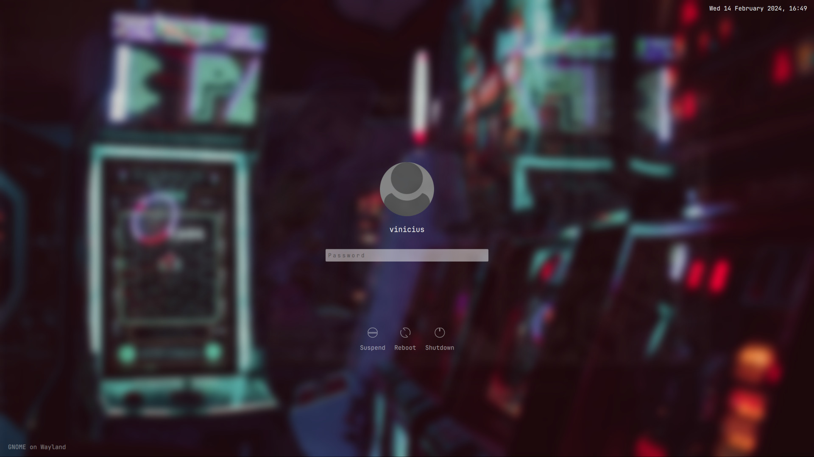

 <h1 align="center">
   
  Arcade theme for SDDM
   
</h1>

TODO: add some text

### Dependencies

  * sddm
  * qt5
  * qt5-quickcontrols
  * qt5-graphicaleffects

### Installing the theme

TODO: detail installation steps

### Credits

- Based on the theme [`Chili login theme for SDDM`](https://github.com/MarianArlt/sddm-chili) by [**MarianArlt**](https://github.com/MarianArlt).

### License

This project is licensed under the GPLv3 License - see the [LICENSE](LICENSE.md) for details
